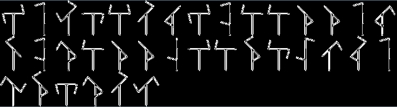
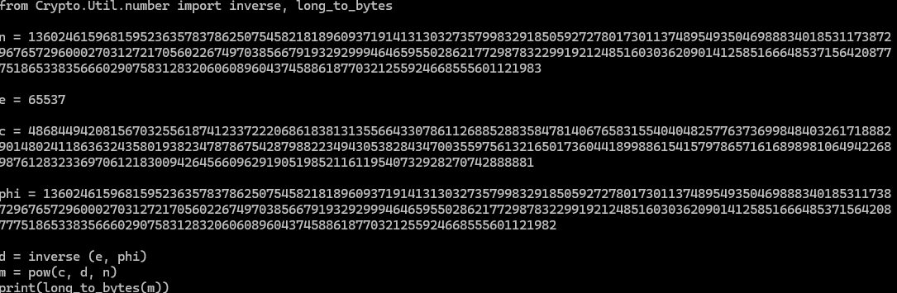
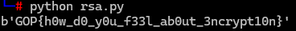
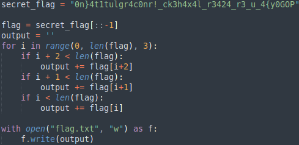

### Chappa

Png dosyasında görüntü olmadığı için stegsolve aracı ile analiz edildi. Sonuç olarak aşağıdaki şifre çıktı.

Chappe Alphabet decoder ile şifre çözüldü.
I5HVA62IGRRWW5DSGFRWWXZRONPUM5KOEF6Q

Çıkan sonuç Base32 decoder ile deşifrelendi.

**flag:** _GOP{H4cktr1ck_1s_FuN!}_

### Baby RSA

Verilen n, e ve c değerlerinden plaintext çıkarmak için bir script yazıldı.

**flag:** _GOP{h0w_d0_y0u_f33l_ab0ut_3ncrypt10n}_

### Reverse Me

Verilen flag.txt içindeki string, secret_flag input içine yazıldı. Ardından kod if statement ile düzeltildikten sonra flag elde edildi.

**flag:** _GOP{y0u_4r3_24_r344l_h4xck3r!_c0ngr4tul4t10n}_
