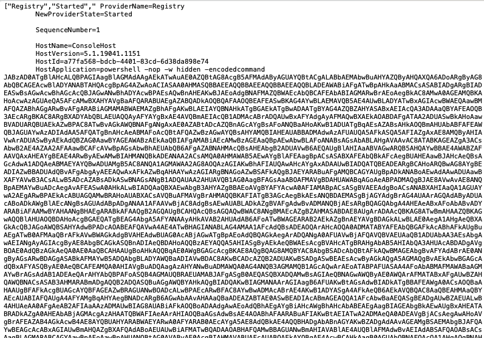
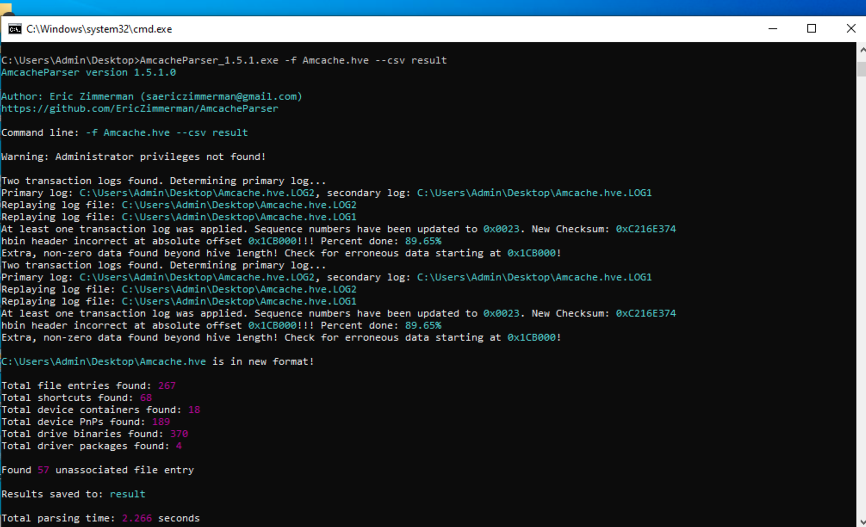
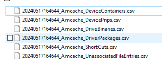
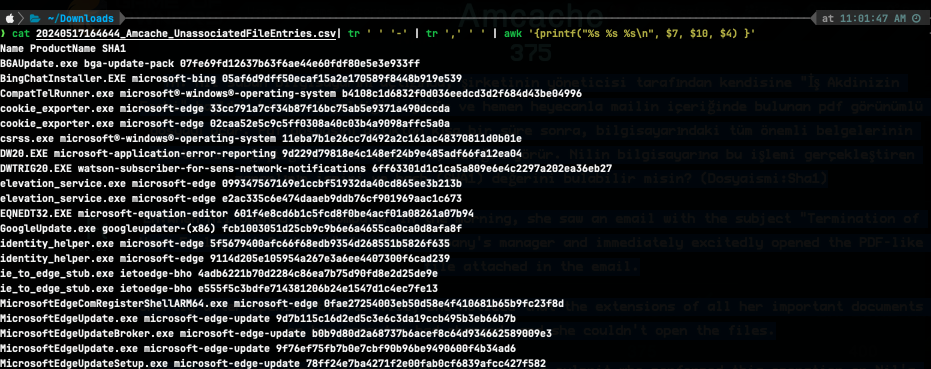
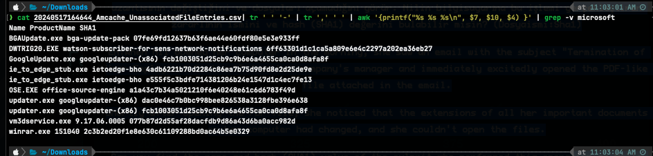
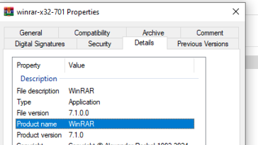

### Powershell

Verilen log dosyası analiz edilerek powershell komutu tespit edilmiştir.  

Bu komut bat dosyasına kayıtedilerek any.run sitesine yüklenmiştir ve davranışları analiz edilmiştir. Zararlı powershell komutu `176.103.56.89:8080` adresine bağlanmaya çalıştığını tespit edilmiştir.  

**Flag:** _GOP{176.103.56.89:8080}_

###  Amcache

**Soru:** *TR: Nil sabah bilgisayarını açtığında, şirketinin yöneticisi tarafından kendisine "İş Akdinizin Feshi" başlıklı bir mail geldiğini görür ve hemen heyecanla mailin içeriğinde bulunan pdf görünümlü dosyayı açar. Pdf dosyasını açtıktan kısa bir süre sonra, bilgisayarındaki tüm önemli belgelerinin uzantısının değiştiğini ve dosyaları açamadığını görür. Nilin bilgisayarına bu işlemi gerçekleştiren zararlının ismini ve hash (SHA1) değerini bulabilir misin? (Dosyaismi:Sha1)

AmcacheParser ile verilen dosya parse edilir.  

İstenilen program olduğundan dolayı 'İlişkilendirilmemiş dosya girişleri' dosyayı incelenir.  

'İlişkilendirilmemiş dosya girişleri' dosyayının 'Name', 'ProductName' ve 'SHA1' sütünleri dikkate alınır.  

Aranan program malware olduğundan Microsoft'a ait dosyalar filtrelenir ve geriye kalan dosyalar incelenir.

Burada ProductName'i olmayan `vm3dservice.exe` ve `winrar.exe` görülmektedir. ProductName'de yazılan `9.17.06.0005`ve `151040` bilgileri ProductName sütünü boş olduğundan bir önceki sütünden alınmaktadır.

Gerçek Winrar programının bilgileri incelendiğinde uyuşmadığı görülmektedir.  

**Flag:** _GOP{winrar.exe:2c3b2ed20f1e8e630c61109288bd0ac64b5e0329}_
