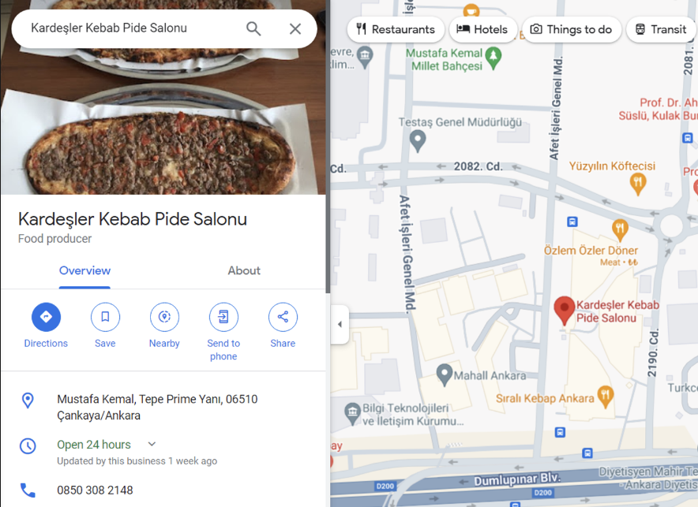
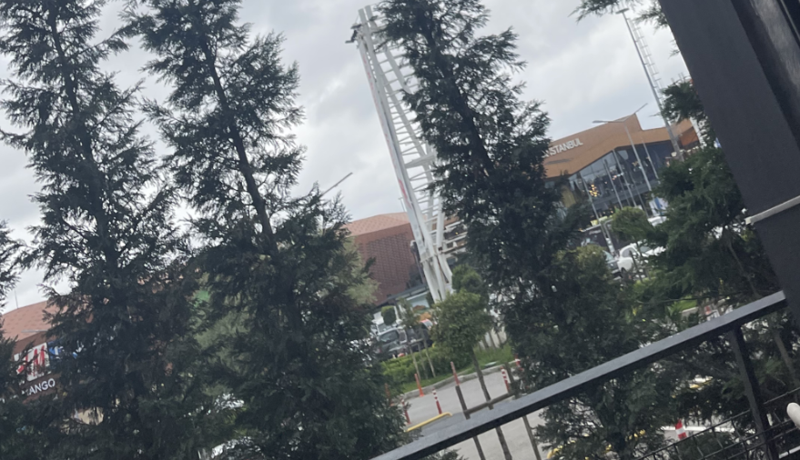

### Police Raid

Soruda verilen bilgilere göre kriminal bir olayda Kardeşler Kebap Pide Salonu’na ait sürekli yemek poşetleri tespit ediliyor. Ayrıca soruda da suçlunun kaçarken “1337” diye seslendiğini ve kod adının buna ait olabileceği de belirtiliyor. Bununla birlikte olaya karışan Kardeşler Kebap Pide Salonu’nun son bir ay içerisinde açıldığı belirtildiği için işletmeyi daha rahat bir şekilde buluyoruz.

**Flag:** _GOP{lahmacunpidedendahaiyi}_

### Search

Fotoğrafın exiftool’dan konumunu tespit ediyoruz. Aynı zamanda burayı TTMO sunumlarından hatırlıyoruz. Konum Meydan Istanbul AVM, çevresindeki işletmelere bakıyoruz. 

İşletmelerin birinin yorumlarında flag’i buluyoruz. İşletme sahibi flag’i silmiş olsa ki daha sonrasında ne yazık ki bulamadık.

**Flag:** _GOP{flag}_