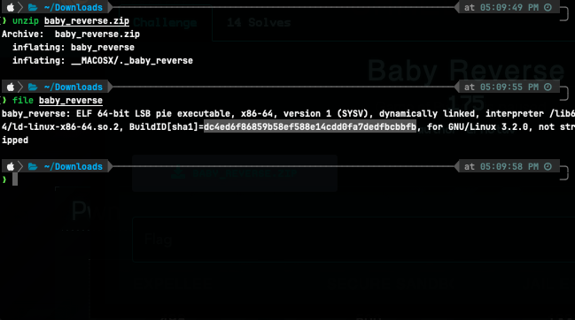
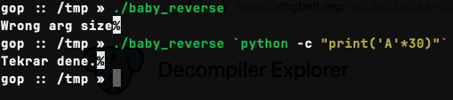
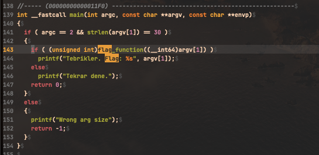
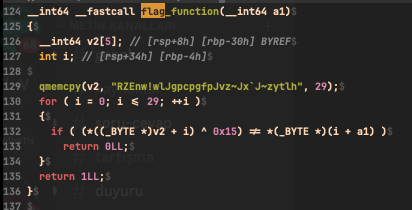
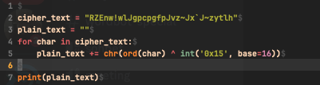
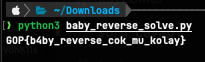
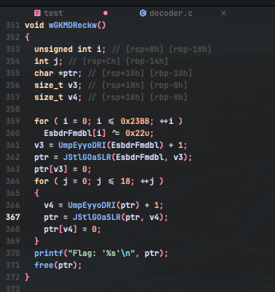
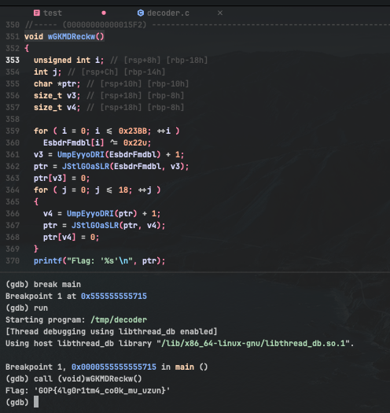

### Baby Reverse

"baby_reverse.zip" adlı arşiv dosyasıdan "baby_reverse" adlı dosya çıkarılıp tipi incelenmiştir.  


Dosya dogblot.com online decompiler'a yüklenip C koduna dönüştürülmüştür. C kodunun main fonksiyonu incelendiğinde kullanıcıdan 30 karakterli parametre istemekte.  

Bu parametreyi `flag_function()` fonksiyonuna verildiği görülmektedir.  



```c
int __fastcall main(int argc, const char **argv, const char **envp)
{
  if ( argc == 2 && strlen(argv[1]) == 30 )
  {
    if ( (unsigned int)flag_function((__int64)argv[1]) )
      printf("Tebrikler. Flag: %s", argv[1]);
    else
      printf("Tekrar dene.");
    return 0;
  }
  else
  {
    printf("Wrong arg size");
    return -1;
  }
}

```

`flag_function()` fonksiyonu incelendiğinde kullanıcının girdisini bir string'in 0x15 ile XOR işlemine sokulduğunu fark görülmektedir. Ardından bu işlemin sonucu kullanıcının girdisiyle aynı olup olmadığını kontrol edilir.  


```c
__int64 __fastcall flag_function(__int64 a1)
{
  __int64 v2[5]; // [rsp+8h] [rbp-30h] BYREF
  int i; // [rsp+34h] [rbp-4h]

  qmemcpy(v2, "RZEnw!wlJgpcpgfpJvz~Jx`J~zytlh", 30);
  for ( i = 0; i <= 29; ++i )
  {
    if ( (*((_BYTE *)v2 + i) ^ 0x15) != *(_BYTE *)(i + a1) )
      return 0LL;
  }
  return 1LL;
}

```

Bu string'in 0x15 ile XOR sunucunu veren Python kodu yazılmıştır.  


```python
cipher_text = "RZEnw!wlJgpcpgfpJvz~Jx`J~zytlh"
plain_text = ""

for char in cipher_text:
    plain_text += chr(ord(char) ^ int('0x15', base=16))

print(plain_text)
```

**Flag:** _GOP{b4by_reverse_cok_mu_kolay}_

###  Decoder

Dosya dogblot.com online decompiler'a yüklenip C koduna dönüştürülmüştür. C kodunun Main fonksiyonu flag ile ilgili işlem yapmamaktadır.  


C kodu daha detaylı incelendiğinde `wGKMDReckw()` adlı fonksiyon bulunmuştur. Bu fonksiyon karmaşık işlemler yaparak flag'ı oluşturup ekrana basmaktadır.  

Flag'ı elde etmek için program gdb ile çalıştırlıp `wGKMDReckw()`fonksiyonu çağrılmaktadır.  


**Flag:** **_GOP{4lg0r1tm4_co0k_mu_uzun}_**
